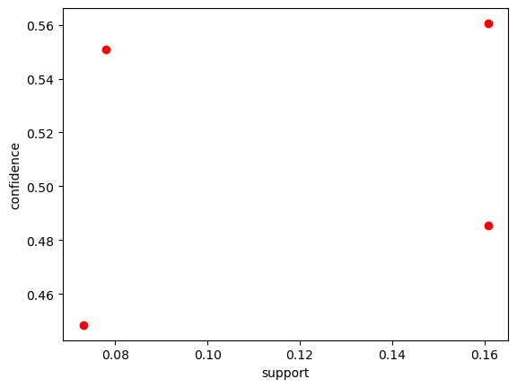

```python
import pandas as pd
path = '/Users/zhangpuchang/Downloads/anonymous-msweb.data'
data = pd.read_csv(path,  header=None)
print(data)
```

            0      1      2                                3            4
    0       A   1287      1          International AutoRoute   /autoroute
    1       A   1288      1                          library     /library
    2       A   1289      1  Master Chef Product Information  /masterchef
    3       A   1297      1                  Central America    /centroam
    4       A   1215      1         For Developers Only Info   /developer
    ...    ..    ...    ...                              ...          ...
    131654  V   1035      1                              NaN          NaN
    131655  V   1001      1                              NaN          NaN
    131656  V   1018      1                              NaN          NaN
    131657  C  42711  42711                              NaN          NaN
    131658  V   1008      1                              NaN          NaN
    
    [131659 rows x 5 columns]


    /var/folders/r1/m1k3791j6y7598kjmrl0fslr0000gn/T/ipykernel_98249/3061785650.py:3: DtypeWarning: Columns (3,4) have mixed types. Specify dtype option on import or set low_memory=False.
      data = pd.read_csv(path,  header=None)


```python
data.head()
```


<div>
<style scoped>
    .dataframe tbody tr th:only-of-type {
        vertical-align: middle;
    }

    .dataframe tbody tr th {
        vertical-align: top;
    }

    .dataframe thead th {
        text-align: right;
    }
</style>
<table border="1" class="dataframe">
  <thead>
    <tr style="text-align: right;">
      <th></th>
      <th>0</th>
      <th>1</th>
      <th>2</th>
      <th>3</th>
      <th>4</th>
    </tr>
  </thead>
  <tbody>
    <tr>
      <th>0</th>
      <td>A</td>
      <td>1287</td>
      <td>1</td>
      <td>International AutoRoute</td>
      <td>/autoroute</td>
    </tr>
    <tr>
      <th>1</th>
      <td>A</td>
      <td>1288</td>
      <td>1</td>
      <td>library</td>
      <td>/library</td>
    </tr>
    <tr>
      <th>2</th>
      <td>A</td>
      <td>1289</td>
      <td>1</td>
      <td>Master Chef Product Information</td>
      <td>/masterchef</td>
    </tr>
    <tr>
      <th>3</th>
      <td>A</td>
      <td>1297</td>
      <td>1</td>
      <td>Central America</td>
      <td>/centroam</td>
    </tr>
    <tr>
      <th>4</th>
      <td>A</td>
      <td>1215</td>
      <td>1</td>
      <td>For Developers Only Info</td>
      <td>/developer</td>
    </tr>
  </tbody>
</table>
</div>


```python
#1.数据处理与预处理
attr = data[data[0] == 'A']  # 属性行
case = data[data[0] != 'A']  # 案例行
print(case)
```

            0      1      2    3    4
    294     C  10001  10001  NaN  NaN
    295     V   1000      1  NaN  NaN
    296     V   1001      1  NaN  NaN
    297     V   1002      1  NaN  NaN
    298     C  10002  10002  NaN  NaN
    ...    ..    ...    ...  ...  ...
    131654  V   1035      1  NaN  NaN
    131655  V   1001      1  NaN  NaN
    131656  V   1018      1  NaN  NaN
    131657  C  42711  42711  NaN  NaN
    131658  V   1008      1  NaN  NaN
    
    [131365 rows x 5 columns]


```python
#缺失值处理
attr = attr.dropna()
print(attr)
```

         0     1  2                                3            4
    0    A  1287  1          International AutoRoute   /autoroute
    1    A  1288  1                          library     /library
    2    A  1289  1  Master Chef Product Information  /masterchef
    3    A  1297  1                  Central America    /centroam
    4    A  1215  1         For Developers Only Info   /developer
    ..  ..   ... ..                              ...          ...
    289  A  1219  1    Corporate Advertising Content         /ads
    290  A  1030  1                Windows NT Server    /ntserver
    291  A  1182  1                          Fortran     /fortran
    292  A  1100  1                  MS in Education   /education
    293  A  1210  1                      SNA Support  /snasupport
    
    [294 rows x 5 columns]


```python
case = case.drop(columns=[3, 4])
print(case)
```

            0      1      2
    294     C  10001  10001
    295     V   1000      1
    296     V   1001      1
    297     V   1002      1
    298     C  10002  10002
    ...    ..    ...    ...
    131654  V   1035      1
    131655  V   1001      1
    131656  V   1018      1
    131657  C  42711  42711
    131658  V   1008      1
    
    [131365 rows x 3 columns]


```python
case = case.dropna()
print(case)
```

            0      1      2
    294     C  10001  10001
    295     V   1000      1
    296     V   1001      1
    297     V   1002      1
    298     C  10002  10002
    ...    ..    ...    ...
    131654  V   1035      1
    131655  V   1001      1
    131656  V   1018      1
    131657  C  42711  42711
    131658  V   1008      1
    
    [131365 rows x 3 columns]


```python
tmp = {x[1]:x[3] for _,x in attr.iterrows()}
cases = []
votes = []
vote_tmp = []
case_tmp = 0
for i, line in case.iterrows():
    if line[0]=='C':
        if len(vote_tmp)!=0:
            votes.append(vote_tmp)
            cases.append(case_tmp)
        vote_tmp = []
        case_tmp = line[1]
    else:
        vote_tmp.append(tmp[line[1]])
votes.append(vote_tmp)
cases.append(case_tmp)
```


```python
#2.频繁模式挖掘；
#找出频次最高的十个
from collections import Counter
counter = Counter()
for i in votes:
    counter.update(i)
result = counter.most_common(5)
for value, count in result:
    print(f"{value}: {count}")
```

    Free Downloads: 10836
    Internet Explorer: 9383
    Microsoft.com Search: 8463
    isapi: 5330
    Products : 5108


```python
#可视化结果
import matplotlib.pyplot as plt
plt.bar(counter.keys(), counter.values())
plt.show()
```


    

    


```python
# 3. 关联规则挖掘
#使用association_rules方法，导出关联规则，同时获得支持度及置信度
from mlxtend.preprocessing import TransactionEncoder
from mlxtend.frequent_patterns import apriori, association_rules
tmp = TransactionEncoder()
tmp_array = tmp.fit_transform(votes)
df = pd.DataFrame(tmp_array, columns=tmp.columns_)
frequent_itemsets = apriori(df, min_support=0.06, use_colnames=True)
min_threshold = 0.4  
association_results = association_rules(frequent_itemsets, metric="confidence", min_threshold=min_threshold)

```


```python
# 4. 结果评估
# 打印关联规则的支持度、置信度和提升度
input = ['antecedents', 'consequents', 'support', 'confidence', 'lift']
association_results = association_results[input]
for index, row in association_results.iterrows():
    #print(row)
    antecedents = tuple(row['antecedents'])
    consequents = tuple(row['consequents'])
    print("%s ⇒ %s (suupport = %f, confidence = %f )" % (antecedents, consequents, \
          row['support'], row['confidence']))
print(association_results)
```

    ('Internet Explorer',) ⇒ ('Free Downloads',) (suupport = 0.160802, confidence = 0.560588 )
    ('Free Downloads',) ⇒ ('Internet Explorer',) (suupport = 0.160802, confidence = 0.485419 )
    ('Windows Family of OSs',) ⇒ ('Free Downloads',) (suupport = 0.077925, confidence = 0.550778 )
    ('isapi',) ⇒ ('Free Downloads',) (suupport = 0.073064, confidence = 0.448405 )
                   antecedents          consequents   support  confidence  \
    0      (Internet Explorer)     (Free Downloads)  0.160802    0.560588   
    1         (Free Downloads)  (Internet Explorer)  0.160802    0.485419   
    2  (Windows Family of OSs)     (Free Downloads)  0.077925    0.550778   
    3                  (isapi)     (Free Downloads)  0.073064    0.448405   
    
           lift  
    0  1.692267  
    1  1.692267  
    2  1.662652  
    3  1.353616  


```python
#5 结果分析
1. Internet Explorer 与 Free Downloads强相关
2. Windows Family of OSs 与 Free Downloads 强相关
```


```python

#6.可视化展示
plt.xlabel('support')
plt.ylabel('confidence')
for i in range(association_results.shape[0]):
    plt.scatter(association_results.support[i],association_results.confidence[i],c='r')
```


    

    

